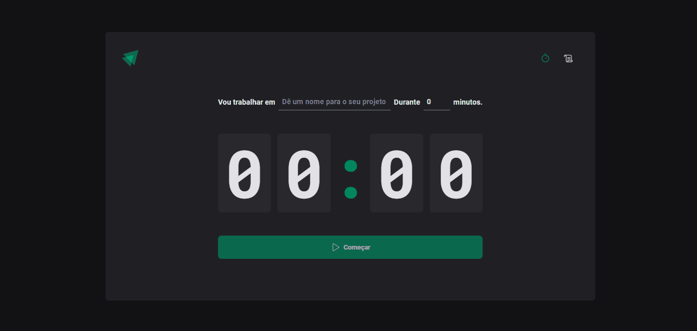

# Ignite Timer

Projeto feito com Diego Fernandes, um dos instrutores da Rocketseat. Aprendi diversos conceitos como: React Router, Styled-Components, React-hook-form é Immer para trabalhar com dados imutaveis. Outros conceitos também foram abordados como a utilização do useEffect, useReducer é useContext.

[Clique aqui para abrir o site de visualização](https://02-ignite-timer-three-jade.vercel.app/)

## 🚀 Tecnologias

Esse projeto foi desenvolvido com as seguintes tecnologias:

- ReactJS
- TypeScript
- Styled-Components
- React Router
- React Hook Form
- Zod
- [Node e NPM](https://nodejs.org/)
- [Vite](https://vitejs.dev/)

